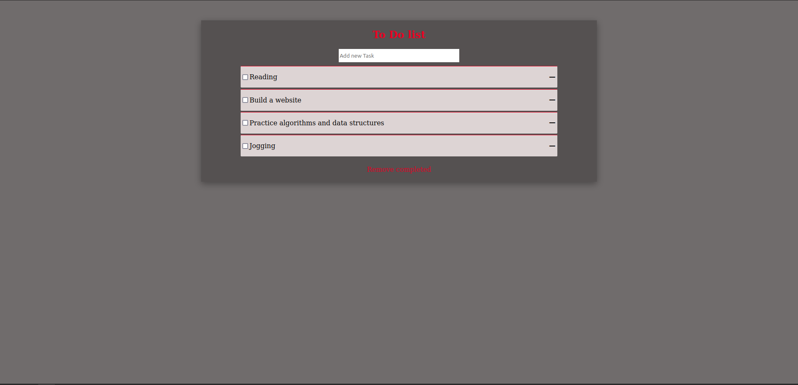

# toToList

> This project is simple minimalist to-do-list.
### Features:

  - Add new Task
  - Remove Task
  - Reorder tasks
  - Delete task
  - Clear completed tasks

Additional description about the project and its features.

## Built With
    HTML
    CSS
    JS

## Live Demo

[Live Demo Link](https://venerable-starburst-ce2e04.netlify.app/)

## Getting Started

### Prerequisites
  **webpack**,
  **HtmlWebpackPlugin**,
  **style-loader css-loader**,
  **webpack-dev-server**

## Setup

#### $git clone https://github.com/SimonGrchevski/ToDoList.git
#### $cd to-do-list
#### $npm install
#### $npm run build
#### $npm start

## Authors

👤 **Simon Grchevski**

- GitHub: [Github](https://github.com/SimonGrchevski)
- LinkedIn: [LinkedIn](https://www.linkedin.com/in/simon-grchevski-682935209/)
- Twitter: [Twitter](https://twitter.com/grchevski)

## 🤝 Contributing

Contributions, issues, and feature requests are welcome!

Feel free to check the [issues page](../../issues/).

## Show your support

Give a ⭐️ if you like this project!

## Acknowledgments

- Hat tip to anyone whose code was used
- Inspiration
- etc

## 📝 License

This project is [MIT](./MIT.md) licensed.

